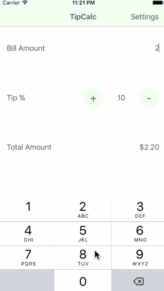

# TipCalc
TipCalc is a tip calculator application for iOS.

Time spent: 8 hours spent in total

Completed:

 * [x] Required: User can enter a bill amount, choose a tip percentage, and see the tip and total values.
 * [x] Required: Settings page to change the default tip percentage.
 * [x] Optional: Remembering the bill amount across app restarts (if < 10mins).
 * [x] Optional: Using locale-specific currency and currency thousands separators.
 * [x] Optional: Making sure the keyboard is always visible and the bill amount is always the first responder. This way the user doesn't have to tap anywhere to use this app. Just launch the app and start typing.
 * [x] Optional: Light/dark color theme in settings view.
 * [x] Additional: User can change the count of persons to split the total amount (upto 100).
 
Here's a walkthrough of implemented user stories:

GIF created with [LiceCap](http://www.cockos.com/licecap/).
